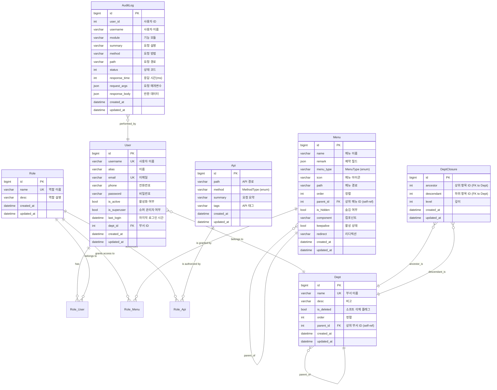

# Entity Relationship Diagram (ERD)

This diagram illustrates the relationships between the main entities in the database. It is represented using [Mermaid](https://mermaid.js.org/) syntax.

You can render this diagram using tools that support Mermaid, such as many Markdown editors, or online viewers.


**Note on Many-to-Many Join Tables:**
The tables `Role_User`, `Role_Menu`, and `Role_Api` represent the intermediate join tables for the many-to-many relationships. Tortoise ORM typically creates these automatically (e.g., as `user_role`, `menu_role`, `api_role`). Their exact structure (column names) might vary based on ORM conventions but generally consist of foreign keys to the linked tables.
The `DeptClosure` table is used for efficient querying of hierarchical department data (ancestors/descendants).
The `FK` in the diagram indicates a Foreign Key relationship. `UK` indicates a Unique Key.
Field descriptions from the models are included where available.
```
